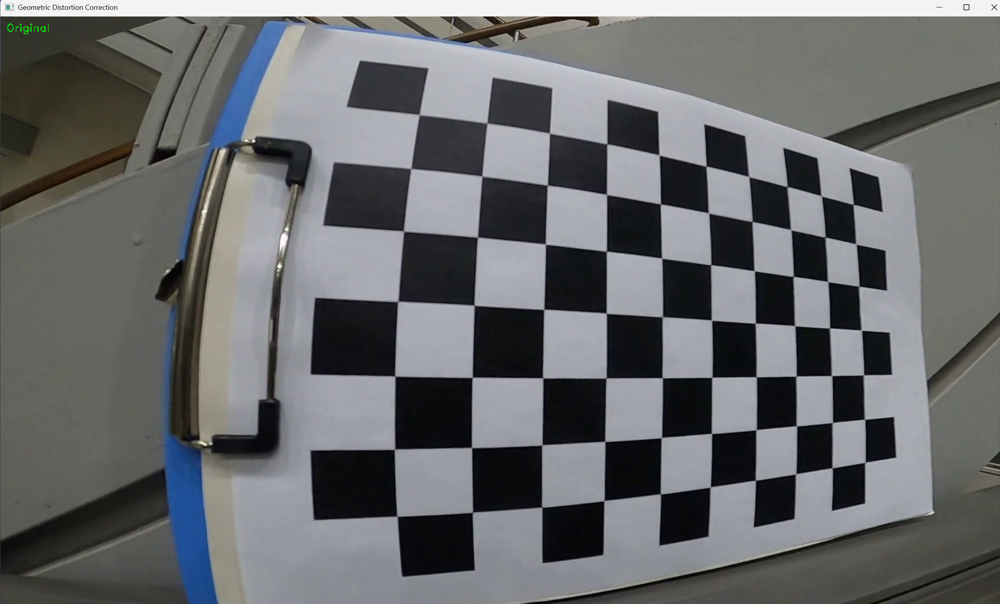
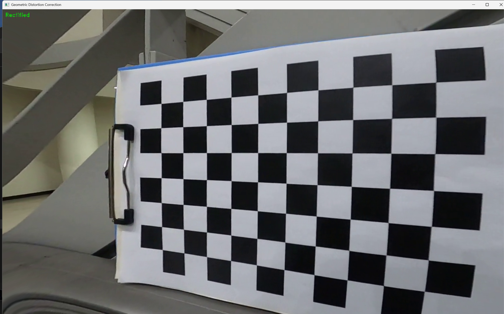
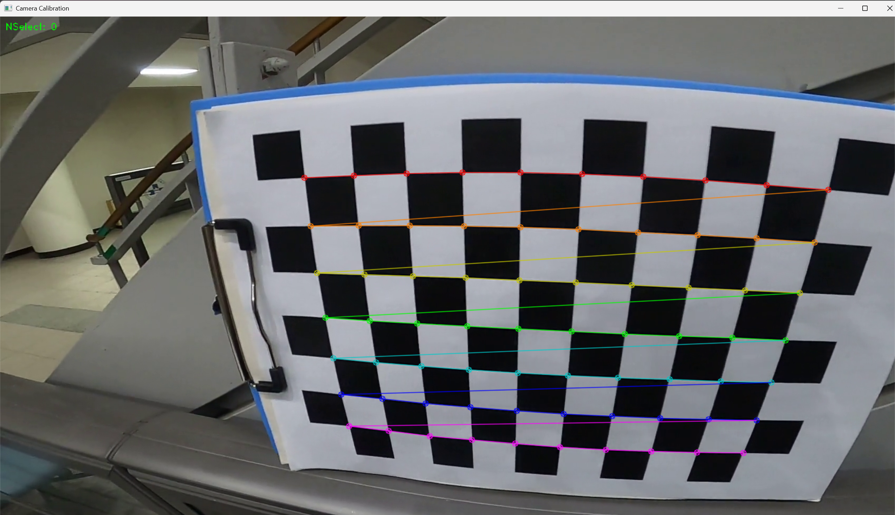
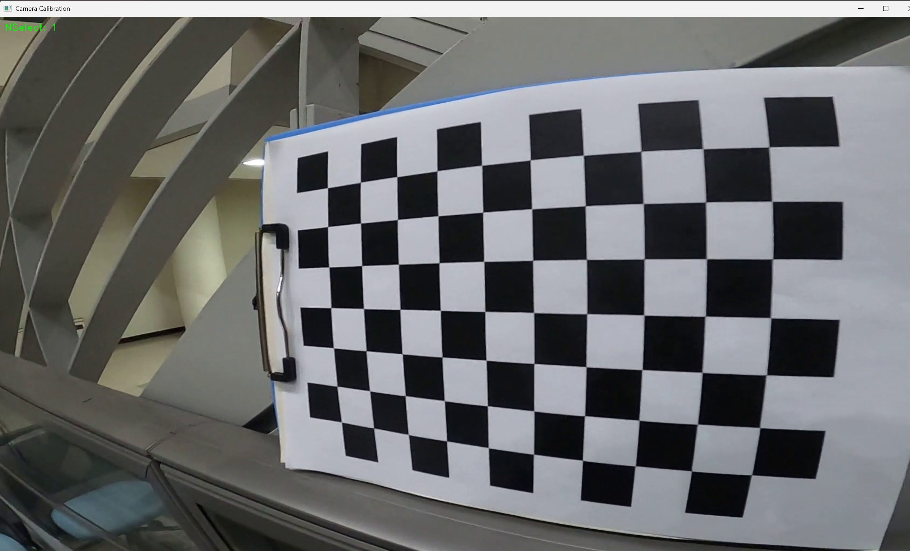

# Camera Calibration and Distortion Correction Tool

A tool to calibrate a GoPro8 SuperWideView video and correct distortion of the video using OpenCV.

| Origin | Rectified |
|--------------------------------------|-------------------------------------------|
||| 

## 📅 Project Overview
This tool was created as part of a project to perform camera calibration and lens distortion correction based on a chessboard video input.

## ✨ Features
- Camera calibration using chessboard patterns
- Lens distortion correction using calibration results
- Toggle between original and rectified view
- Support for multiple image inputs (tested with 1, 44, and 76 images)

## ⚙️ How It Works

### 1. Camera Calibration

camera_calibration.py

- Load video: `data/chessboard.avi`

- Use **space bar** to pause and select image

- Use **Enter** to confirm image selection and the Nselect increases

- Use **ESC** to complete selection

### 2. Distortion Correction

python distortion_correction.py

- Use **Tab** to toggle between original and rectified view

  
- Use **ESC** to exit

## 🔹 Calibration Results
| Image Count | fx        | fy        | cx        | cy        | RMSE  |
|-------------|-----------|-----------|-----------|-----------|--------|
| 1           | 313.0     | 273.5     | 1041.9    | 567.0     | 2.564  |
| 44          | 760.6     | 708.7     | 966.4     | 539.2     | 4.330  |
| 76          | 792.9     | 734.4     | 952.5     | 534.8     | 4.974  |

======================================================================================================
Camera Calibration Results
* The number of selected images = 1
* RMS error = 2.5644846135705253
* Camera matrix (K) = 
[[3.13001947e+02 0.00000000e+00 1.04185593e+03]
 [0.00000000e+00 2.73523647e+02 5.67008972e+02]
 [0.00000000e+00 0.00000000e+00 1.00000000e+00]]
* Distortion coefficient (k1, k2, p1, p2, k3, ...) = [-0.03887438  0.00777214  0.00043639  0.0014292  -0.00086478]
=====================================================================================================
* The number of selected images = 44
* RMS error = 4.330268987209413
* Camera matrix (K) = 
[[760.60913613   0.         966.35761847]
 [  0.         708.76761067 539.17018328]
 [  0.           0.           1.        ]]
* Distortion coefficient (k1, k2, p1, p2, k3, ...) = [-0.23078145  0.17038474  0.00320475  0.00778075 -0.06751446]
========================================================================================================
* The number of selected images = 76
* RMS error = 4.974071169710682
* Camera matrix (K) = 
[[792.86298416   0.         952.48662826]
 [  0.         734.3632487  534.80188396]
 [  0.           0.           1.        ]]
* Distortion coefficient (k1, k2, p1, p2, k3, ...) = [-0.24012391  0.16793469 -0.00373626  0.00596004 -0.06071182]

## 🎨 Visual Examples

### Lens Distortion Correction
| 1 Image | 44 Images | 76 Images |
|--------|-----------|-----------|
|  |  |  |
